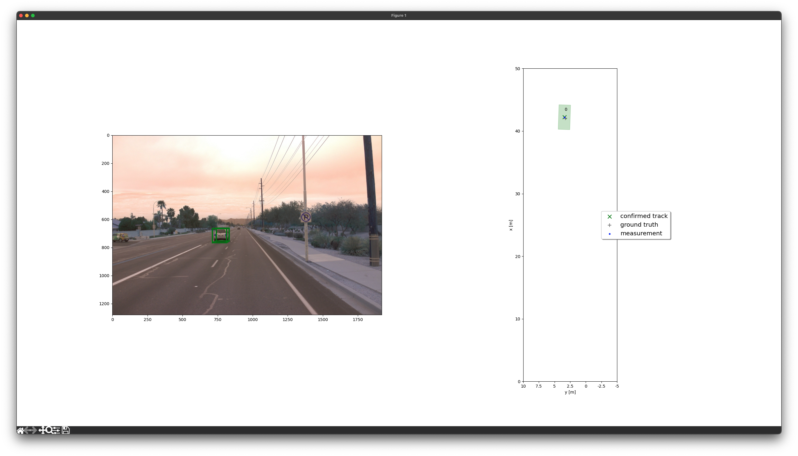
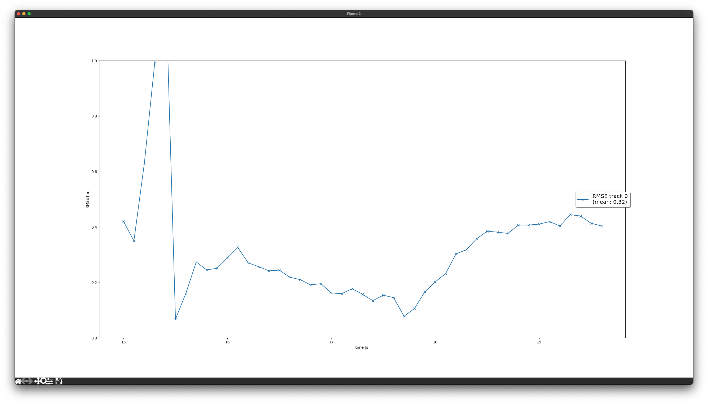
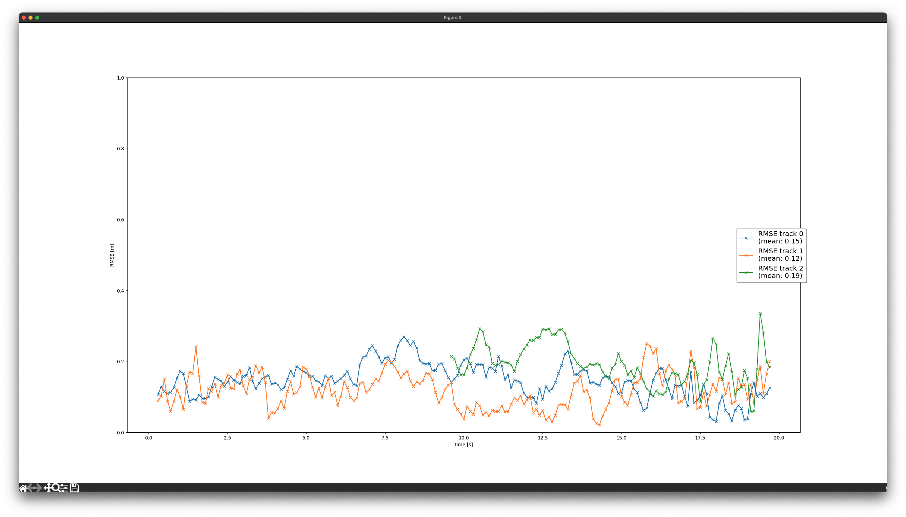
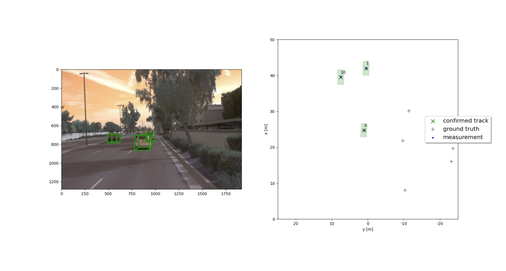
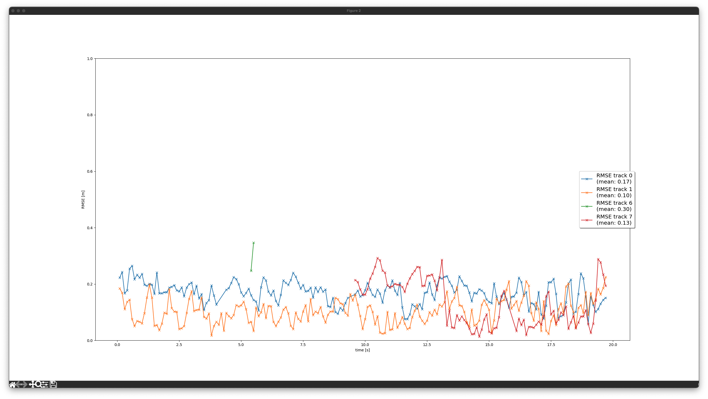

# Writeup: Track 3D-Objects Over Time - final

## Extended Kalman Filter

Implemented [EKF filter](student/filter.py). 

Example of single object tracking:

RMSE plot of one object tracking:

## Track Management

Implemented [track management](student/trackmanagement.py) which will be a basement of multi object tracking system.

## Data Association

Implemented [data association](student/association.py) which is helping multi object tracking with associating which tracking data is matched with measured data.

With above two implementations we finally can track multiple object without hesistation track indexing issue.

RMSE:0.15 / 0.12 / 0.19

## Camera sensor fusion

Implemented [measurement function](student/measurements.py) which was working even before with lidar sensor(only). Extends this class to work with camera data also.

Result doesn't look that different but, as you can see RMSE number got improved compared to data association stage.

RMSE: 0.17 / 0.10 / 0.13

(The green plot is unexpected data noise captured faraway from the ego vehicle.)

You can check the result video in here:
[Video](media/my_tracking_results.mp4)

## Conclusion

### What I Learnt form this project
Learnt very effective method to apply Kalman filter / object tracking system with real recorded vehicle data. Of course, there might be more challenges if we run the system with various scenario but at least, this seems interesting already for me.

### Benefit
Lidar is stable already, but if you consider weather condition, price, and 2d object like traffic light, camera is also required. If we can improve our data with camera data also, we need camera device anyway so there is no reason to not using it.

### Future direction
I want to learn how to apply 'pre-known road context' or 'localization' result into here.

