# Writeup: Track 3D-Objects Over Time - midterm

## Result
Result seems like this:
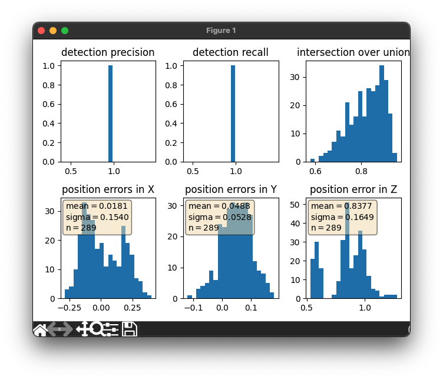

precision = 0.9352750809061489, recall = 0.9444444444444444

### Range image
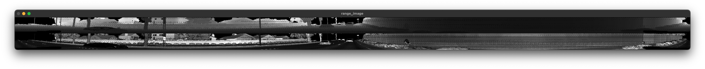

### PCL Images
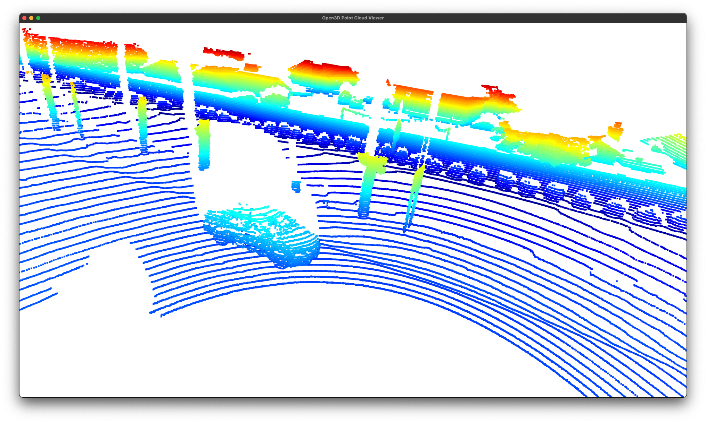
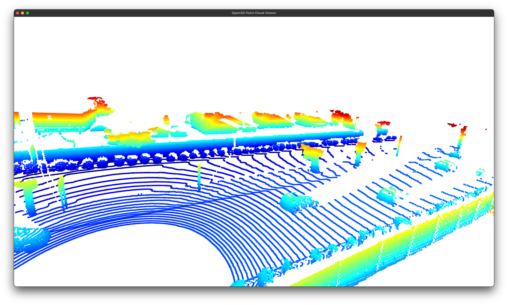
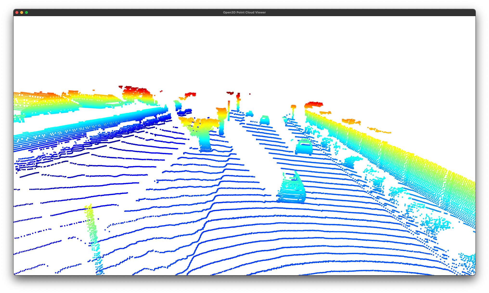
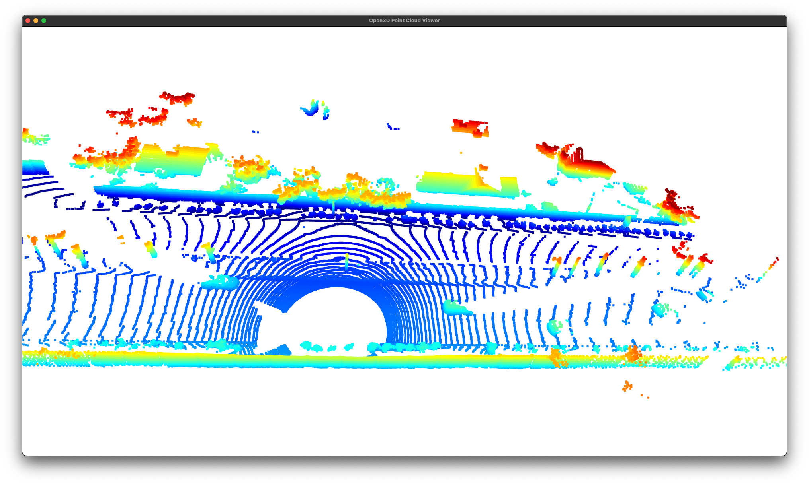
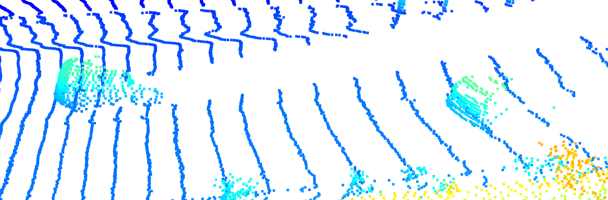
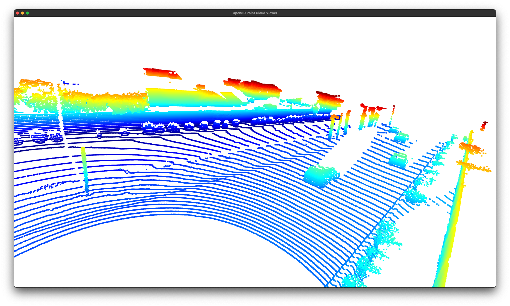
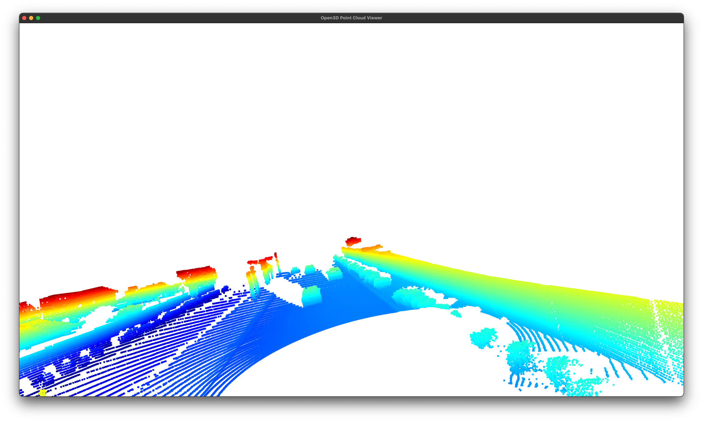
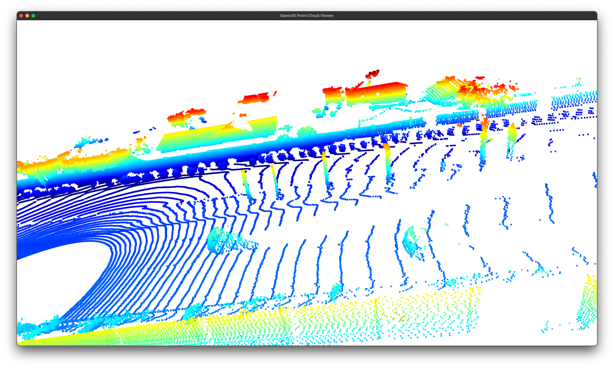
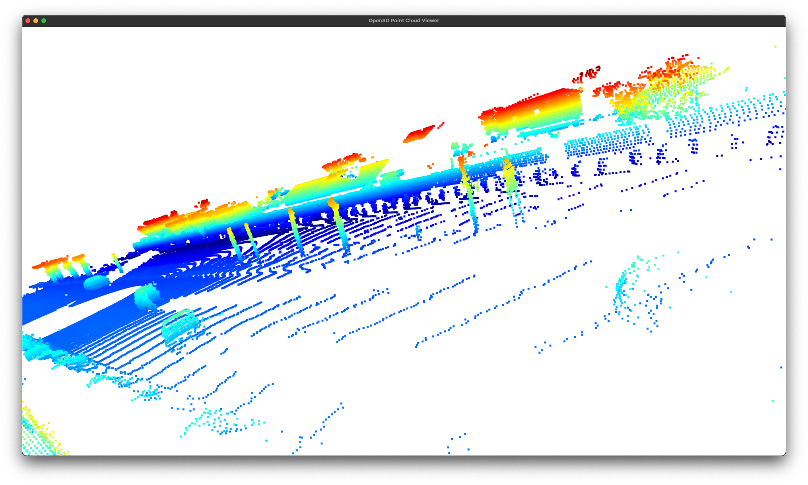
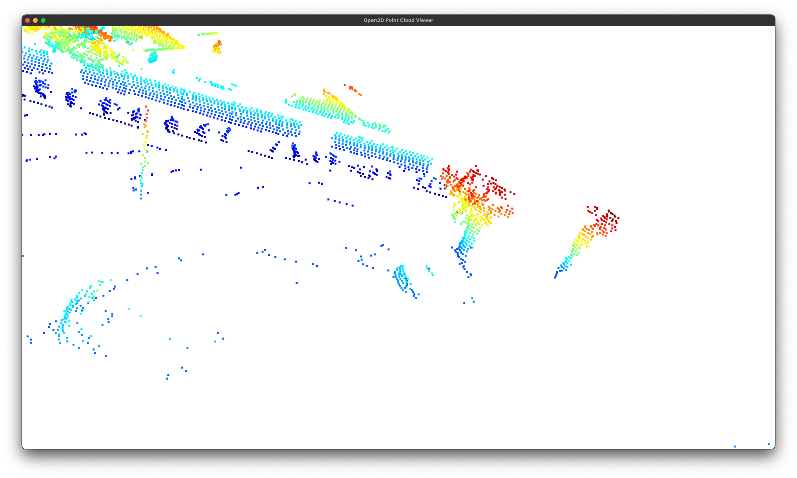

Identifiable common features across the visible vehicles in the point clouds are:

- Side mirrors
- Some number of side windows
- General shpae of car
- Shade after that
- Quiet dense where the car is

### Bird eye view

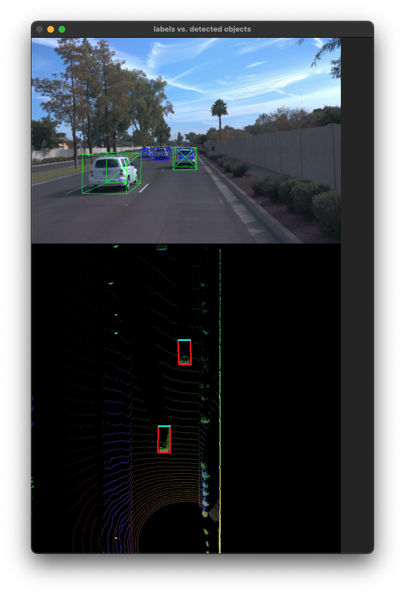

But in the case of bird-eye-view, it is hard to tell there is some features like windows or tires kind of features shown.

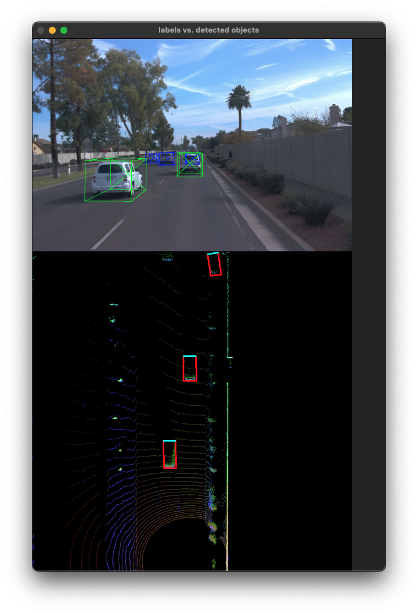

When we concentrate on using BEV only in here, we are actually concentrating on 'height', 'intensity', 'dense'. Which means it doesn't directly give you 'shape' of the some features of the car, but instead it gives pattern which is detectable in numbers.

